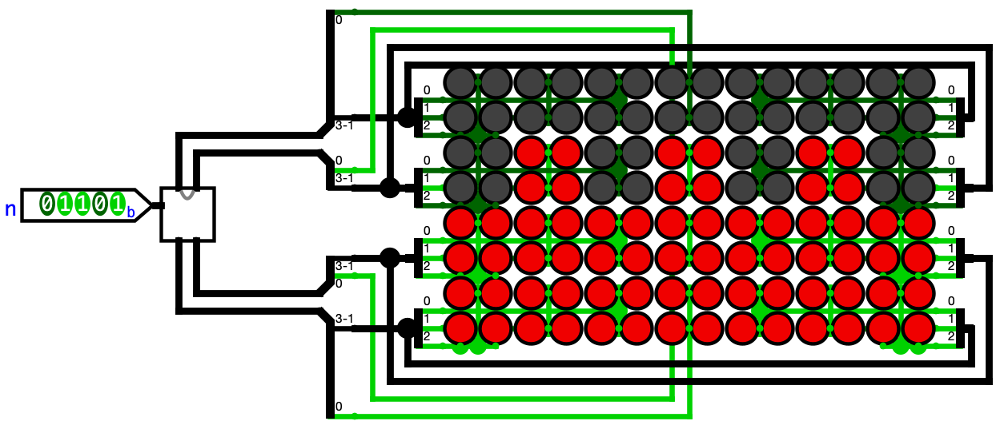

<div align="center">

  # DC from binary to Maya numerals in [Logisim Evolution](https://github.com/logisim-evolution/logisim-evolution)
  
  [How It Works](#how-it-works) • [Files](#files) • [Getting Started](#getting-started) • [License](#license)
  
  [](https://www.linkedin.com/in/alfredo-nader/)
  [](https://github.com/Freddy-Nader) 
  [](https://www.anader.xyz)

  
</div>


A circuit that takes a 5-bit number $n$ and draws it as a Maya numeral (0 to 19) on a 4×7 LED matrix, built and simulated in Logisim-evolution.

## How It Works

The decoder is split into two subcircuits.

1. **EATER** divides $n$ by 5. The quotient $R$ is the number of full bars and the remainder $C$ is the number of loose dots.
2. **CREATOR** turns $C$ and $R$ into four 4-bit words $F_0$ to $F_3$, one per LED row, from the bottom up. Each row shows a bar, the dots or nothing. Zero is detected separately and drawn as the shell.

Inputs from 20 to 31 are not a single Maya digit, so they show the shell too.

## Files

### `maya.circ`

The final circuits. Open this one to see the project working.

| Circuit | What it is |
|---|---|
| `main` | Showcase. One input $n$ drives every version side by side: the bare LED wiring, CREATOR, the no-AI design, the ROM and the 4-bit version. |
| `EATER` | Final 5-bit EATER. |
| `EATER_noAI` | Original 5-bit EATER, factored by hand without AI. |
| `EATER_4bit` | 4-bit EATER, for inputs 0 to 15. |
| `EATER_ROM` | The whole truth table stored in a 32×16 ROM, for comparison. |
| `VARIABLES` | Box with the shared subexpressions used inside `EATER`, to save space. |
| `VARIABLES_4` | Same, for `EATER_4bit`. |
| `CREATOR` | Final CREATOR, with `EATER` inside. |
| `CREATOR_noAI` | `CREATOR` with `EATER_noAI` inside. Only used in `main`. |
| `CREATOR_4bit` | `CREATOR` with `EATER_4bit` inside. Only used in `main`. |

### `tests.circ`

Every idea tried along the way, kept to show how the design changed. The circuits from `main` to `CREATOR_4bit` are copies of the ones in `maya.circ`.

| Circuit | What it is |
|---|---|
| `MAYA_IDEA`, `LEDS` | Early ideas for the LED display. |
| `EATER_1` to `EATER_3`, `EATER_4bit_1` | Earlier versions of EATER. |
| `CREATOR_1` to `CREATOR_8` | Earlier versions of CREATOR. |
| `G4`, `G5` | Checks for whether the input is 20 or more. EATER later absorbed this logic. |

## Getting Started

Install [Logisim-evolution](https://github.com/logisim-evolution/logisim-evolution/releases) 4.1.0 or later, then

```bash
git clone https://github.com/Freddy-Nader/ac-circuits.git
```

Open `maya/maya.circ`. The `main` circuit loads first. Pick the Poke tool (the hand) and click the bits of input `n` to change the number.

This practice is also published on its own at [Freddy-Nader/maya](https://github.com/Freddy-Nader/maya).

## License

This project is open source software licensed under the MIT License. See [LICENSE](../LICENSE) for details.
