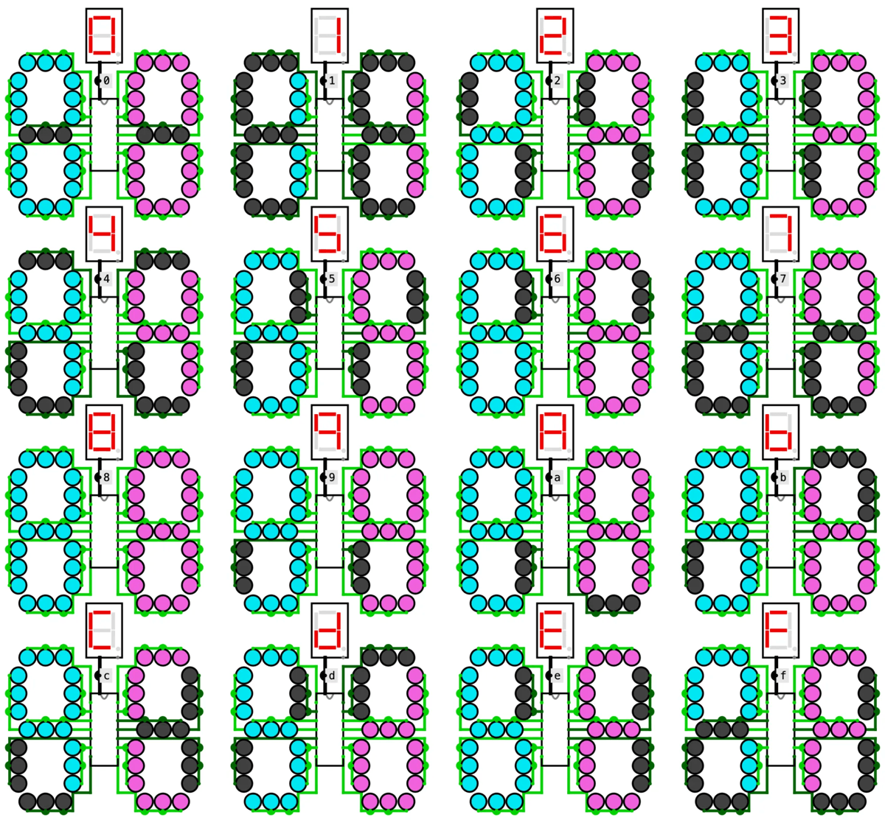

  # Seven-segment decoders in [Logisim Evolution](https://github.com/logisim-evolution/logisim-evolution)

  

Two decoders (DC) that take a 4-bit number $n = x_3x_2x_1x_0$ and light the segments `a` to `g` of a seven-segment display, one for base 10 (digits 0 to 9) and one for base 16 (0 to 9 and A, b, C, d, E, F), built and simulated in Logisim-evolution.

## How It Works

Each segment was synthesized with a four-variable Karnaugh map and then factored, computing the subexpressions shared between segments only once (the Greek letters in the circuits).

1. **DEC** is the base-10 decoder. Inputs 10 to 15 are not BCD digits, so they were treated as don't-cares. That makes it much cheaper (20 two-input-equivalent gates, 3 levels), and those inputs show noise on the display.
2. **HEX** is the base-16 decoder. All sixteen inputs are defined, so it has no don't-cares (44 two-input-equivalent gates, 4 levels).

Segments are active high, as in a common-cathode display. Each segment is drawn with three LEDs so the stroke looks thicker, which is only cosmetic. The outputs are ordered `a`, `f`, `g`, `b`, `c`, `e`, `d`, the order in which the wires reach their segments without crossing.

## Files

### `seven-segments.circ`

The final circuits. Open this one to see the project working.

| Circuit | What it is |
|---|---|
| `main` | Showcase. All sixteen inputs side by side, each one a `SHOWCASE` fed by a fixed constant, with Logisim's hex display on top as reference. |
| `SHOWCASE` | One input `b` drives `DEC` and `HEX` together. Outputs `Da`–`Dg` go to the base-10 display and `Ha`–`Hg` to the base-16 display. |
| `DEC` | Base-10 decoder, input `n`, outputs `a`–`g`. Shared subexpressions α and β. |
| `HEX` | Base-16 decoder, input `n`, outputs `a`–`g`. Shared subexpressions α, β, γ, δ and ε. |
| `LEDS` | Wiring-order test, not used by `main`. Several displays wired with different segment orders (`afgbced`, `dcbafge`, …) to find the order in which the wires reach their segments without crossing, which is `a`, `f`, `g`, `b`, `c`, `e`, `d`. |

### `tests.circ`

An earlier version of the project, kept to show how the design changed. The final circuits are in `seven-segments.circ`.

| Circuit | What it is |
|---|---|
| `main` | One input driving `DNF` and `HYB` side by side. |
| `CHECKING` | Eleven `SHOWCASE` copies to check several inputs at once, the first version of the final `main`. |
| `SHOWCASE` | One input `x` driving `DNF` and `HYB` together, outputs `Da`–`Dg` and `Ha`–`Hg`. |
| `DNF` | TODO: early decoder built as a sum of products (16 AND, 7 OR). |
| `HYB` | TODO: early decoder mixing sums and products, with XOR (5 AND, 10 OR, 3 XOR). |
| `DNF_abcdefg` | Sum-of-products variant with XOR, NOT and NAND gates. |
| `CNF` | Product-of-sums variant built with NAND and NOR gates. |
| `LEDS` | The wiring-order test, also kept in `seven-segments.circ`. |
| `MAYA_IDEA` | Trying a dot-matrix display, the approach from the `maya` practice. |

## Getting Started

Open `seven-segments/seven-segments.circ` in Logisim-evolution 4.1.0 or later. The `main` circuit loads first and shows all sixteen inputs at once. To try a single input, open `SHOWCASE` (or `DEC` / `HEX`), pick the Poke tool (the hand) and click the input bits to change the number.
